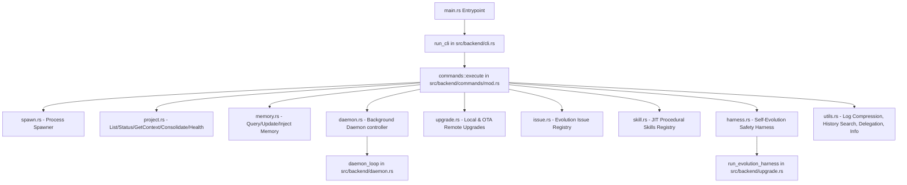

# AGY Orchestrator System Architecture Guide

Welcome! This document outlines the architectural hierarchy and component structure of the `agy_orchestrator` project, designed to be easily parsed and maintained by both human developers and AI coding agents.

---

## 🏛️ System Component Overview

The codebase is split into two primary layers:
1. **Frontend (Dioxus)**: Web-based JIT visual dashboard dashboard (`src/frontend/`).
2. **Backend (Rust)**: System CLI subcommands, health check logic, and background monitoring daemon (`src/backend/`).

---

## 📂 Subcommand Module Details (`src/backend/commands/`)

All CLI subcommands are mapped in `src/backend/commands/mod.rs` and routed to dedicated, single-responsibility modules:

| Subcommand | Handler Module | File Scheme Link | Description |
| :--- | :--- | :--- | :--- |
| `spawn` | `spawn.rs` | [spawn.rs](file:///home/wimvm/works/agy_orchestrator/src/backend/commands/spawn.rs) | Spawns background project agents with playbook & context injection. |
| `list`, `status`, `get-context`, `consolidate`, `health-check` | `project.rs` | [project.rs](file:///home/wimvm/works/agy_orchestrator/src/backend/commands/project.rs) | Coordinates local workspace registration, statuses, and JIT consolidation. |
| `query-memory`, `update-memory`, `inject-memory` | `memory.rs` | [memory.rs](file:///home/wimvm/works/agy_orchestrator/src/backend/commands/memory.rs) | Manages Obsidian-style memory vault query and JIT notes injection. |
| `daemon` | `daemon.rs` | [daemon.rs](file:///home/wimvm/works/agy_orchestrator/src/backend/commands/daemon.rs) | Controls background agent management loop process state (start/stop/run). |
| `self-upgrade` | `upgrade.rs` | [upgrade.rs](file:///home/wimvm/works/agy_orchestrator/src/backend/commands/upgrade.rs) | Re-compiles local binary or downloads remote releases for OTA updates. |
| `issue` | `issue.rs` | [issue.rs](file:///home/wimvm/works/agy_orchestrator/src/backend/commands/issue.rs) | Tracks evolution goals, tasks status, and resolution logs. |
| `load-skill`, `learn-skill` | `skill.rs` | [skill.rs](file:///home/wimvm/works/agy_orchestrator/src/backend/commands/skill.rs) | Manages procedural guidelines Level 1 and YAML frontmatter indexing. |
| `evolution-harness` | `harness.rs` | [harness.rs](file:///home/wimvm/works/agy_orchestrator/src/backend/commands/harness.rs) | Gatekeeper running compiler lint checks and test runners. |
| `compress`, `search-history`, `delegate`, `info` | `utils.rs` | [utils.rs](file:///home/wimvm/works/agy_orchestrator/src/backend/commands/utils.rs) | Utilities for token compression, delegation logs, and info display. |

---

## 🛡️ Hermes-Level Agent Harness System

To prevent evolutionary drift or accidental corruption, we enforce a strict validation loop via `/home/wimvm/works/agy_orchestrator/src/backend/commands/harness.rs`:

1. **Workspace Root Detection**: Searches parent folders from `std::env::current_exe()`. If running as a global precompiled binary, safely falls back to `std::env::current_dir()`.
2. **Static Integrity Gate**: Compares working directory changes against `HEAD`. If too many comments (`//`, `///`, `/*`) are deleted without equivalent replacement, the harness rejects the changes.
3. **Clippy Lint Gate**: Enforces zero code warning constraints (`cargo clippy --all-targets -- -D warnings`).
4. **Test Run Gate**: Ensures no regressions are introduced via unit testing suites.
5. **Detailed Failure Diagnostic Logs**: On failure, dumps a complete diagnostic snapshot including the workspace `git diff` to `~/.agy_orchestrator/logs/evolution_failed_issue_{issue_id}.log` before performing hard rollback (`git reset --hard HEAD`), aiding the next agent's recovery.
