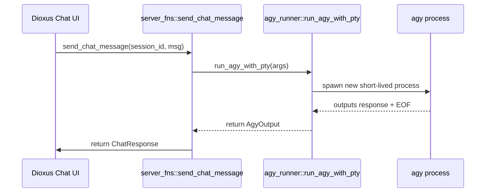
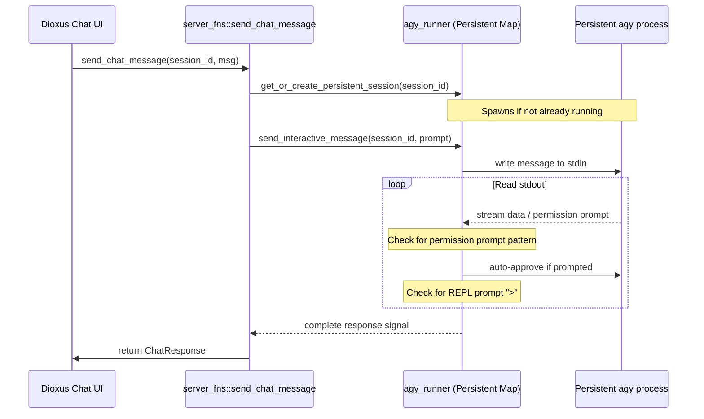

# Refactoring Plan: Persistent Background Chat Process per Conversation

This plan outlines the changes required to transition the chat assistant from a one-shot process execution model to a persistent, interactive background process model per chat room (mapped by conversation ID).

---

## 1. Objectives

- **Persistence**: Instead of spawning a new `agy` process for every user chat message, maintain a single running interactive `agy` CLI process per active conversation ID.
- **Dynamic I/O Piping**: Pipe new chat messages directly into the running process's standard input (`stdin`) and read standard output (`stdout`/`stderr`) dynamically.
- **Real-Time Auto-Approval**: Intercept and answer platform-level permission prompts (e.g. `Allow ...? (y/n)`) generated by subagents in real-time.
- **Completion Detection**: Read process output until the REPL prompt `>` is reached, signaling that the agent is done processing the input and waiting for the next one.
- **Clean Termination**: Ensure the background process is terminated cleanly when a conversation is deleted, especially before the workspace directory cleanup occurs.
- **Fail-safety**: Handle edge cases such as process crashes, hangs, or timeouts by automatically restarting the process if necessary.

---

## 2. Current Architecture vs. Proposed Architecture

### Current Architecture
- Spawns `agy` with `--prompt "<payload>"` and optionally `--conversation <id> --continue` for every single message.
- The process is short-lived, runs to completion (EOF), and terminates.
- Latency is high due to process startup overhead, authentication, and session loading on every message.



### Proposed Architecture
- Keep a global thread-safe map of active `agy` sessions: `OnceLock<Mutex<HashMap<String, ActiveSession>>>`.
- If a session does not exist, spawn `agy --conversation <session_id>` interactively and wait for the initial REPL prompt.
- Write new messages to the existing session's stdin and read stdout/stderr until the next REPL prompt `>` is reached.
- Cleanly terminate the process on session deletion.



---

## 3. Implementation Details

### A. Global Process Map Design

We will introduce an `ActiveSession` struct and a static thread-safe map in `src/backend/agy_runner.rs`:

```rust
use std::sync::{Mutex, OnceLock};
use std::collections::HashMap;

pub struct ActiveSession {
    /// The active interactive PtySession from rexpect
    pub session: rexpect::session::PtySession,
    /// The OS PID of the spawned process
    pub pid: u32,
    /// Timestamp of creation or last interaction (for timeout cleanup)
    pub last_active: std::time::Instant,
}

// Global thread-safe map mapping conversation IDs to active sessions
pub static ACTIVE_SESSIONS: OnceLock<Mutex<HashMap<String, ActiveSession>>> = OnceLock::new();
```

### B. REPL Prompt Detection & Formatting

From dynamic analysis of the `agy` process, the REPL prompt is printed as a colored blue `>` followed by text styling resets, which corresponds to the ANSI sequence:
`\x1b[94m>\x1b[m`

To match this robustly via `rexpect`'s `exp_regex`, we will define a pattern that matches this colored prompt:
`const REPL_PROMPT_PATTERN: &str = r"\x1b\[94m>\x1b\[m";`

### C. Refactoring `src/backend/agy_runner.rs`

We will add the following public functions under `src/backend/agy_runner.rs` (guarded by `#[cfg(feature = "server")]`):

#### 1. `get_or_create_persistent_session`
Retrieves an existing session from `ACTIVE_SESSIONS` or spawns a new one if it doesn't exist or is dead.

```rust
#[cfg(feature = "server")]
pub fn get_or_create_persistent_session(conversation_id: &str) -> io::Result<u32> {
    let mut map = ACTIVE_SESSIONS.get_or_init(|| Mutex::new(HashMap::new())).lock().unwrap();
    
    // Clean up if process died
    if let Some(active) = map.get(conversation_id) {
        if !crate::backend::state::is_pid_alive(active.pid) {
            map.remove(conversation_id);
        }
    }
    
    if !map.contains_key(conversation_id) {
        let agy_bin = std::env::var("AGY_BIN").unwrap_or_else(|_| {
            let home = std::env::var("HOME").unwrap_or_else(|_| "/home/wimvm".to_string());
            format!("{}/.local/bin/agy", home)
        });
        
        let mut cmd = std::process::Command::new(&agy_bin);
        let workspace_dir = "/home/wimvm/works/agy_orchestrator";
        if std::path::Path::new(workspace_dir).exists() {
            cmd.arg("--add-dir");
            cmd.arg(workspace_dir);
            cmd.current_dir(workspace_dir);
        }
        cmd.arg("--conversation");
        cmd.arg(conversation_id);
        
        // Spawn interactive command
        let mut session = rexpect::session::spawn_command(cmd, Some(10000))
            .map_err(|e| io::Error::other(e.to_string()))?;
            
        // Access pid via shadow struct transmute
        struct PtyProcessShadow {
            pty: std::os::fd::OwnedFd,
            child_pid: i32,
            kill_timeout: Option<std::time::Duration>,
        }
        let pid = unsafe {
            let shadow: &PtyProcessShadow = std::mem::transmute(session.process());
            shadow.child_pid as u32
        };
        
        // Wait for the initial prompt (startup sign-in and logo display)
        let combined_pattern = format!(
            "({})|({})",
            AUTO_APPROVE_PATTERNS.iter().map(|(p, _)| format!("({})", p)).collect::<Vec<_>>().join("|"),
            REPL_PROMPT_PATTERN
        );
        
        loop {
            match session.exp_regex(&combined_pattern) {
                Ok((_, matched)) => {
                    if matched.contains('>') {
                        break; // Prompt reached
                    } else {
                        // Startup permission/approval checks (if any)
                        let response = find_auto_approve_response(&matched);
                        let _ = session.send_line(response);
                    }
                }
                Err(e) => return Err(io::Error::other(format!("Failed to reach initial REPL prompt: {}", e))),
            }
        }
        
        map.insert(conversation_id.to_string(), ActiveSession {
            session,
            pid,
            last_active: std::time::Instant::now(),
        });
    }
    
    Ok(map.get(conversation_id).unwrap().pid)
}
```

#### 2. `send_interactive_message`
Sends the prompt message to the active session and waits for output to complete.

```rust
#[cfg(feature = "server")]
pub fn send_interactive_message(
    conversation_id: &str,
    prompt: &str,
    log_path: Option<&std::path::Path>,
) -> io::Result<()> {
    let mut map = ACTIVE_SESSIONS.get_or_init(|| Mutex::new(HashMap::new())).lock().unwrap();
    let active = map.get_mut(conversation_id)
        .ok_or_else(|| io::Error::other("Session not found"))?;
        
    active.last_active = std::time::Instant::now();
    
    let mut log_file = if let Some(path) = log_path {
        if let Some(parent) = path.parent() {
            let _ = std::fs::create_dir_all(parent);
        }
        Some(std::fs::OpenOptions::new().create(true).append(true).open(path)?)
    } else {
        None
    };

    // Send input message
    active.session.send_line(prompt).map_err(|e| io::Error::other(e.to_string()))?;
    
    let combined_pattern = format!(
        "({})|({})",
        AUTO_APPROVE_PATTERNS.iter().map(|(p, _)| format!("({})", p)).collect::<Vec<_>>().join("|"),
        REPL_PROMPT_PATTERN
    );
    
    let mut last_timeout_got_len = 0;
    
    // Read stdout until prompt is reached
    loop {
        match active.session.exp_regex(&combined_pattern) {
            Ok((before, matched)) => {
                if let Some(file) = log_file.as_mut() {
                    let _ = write!(file, "{}{}", before, matched);
                    let _ = file.flush();
                }
                
                if matched.contains('>') {
                    break; // Completed execution, REPL prompt reached
                } else {
                    // Auto-approve permission request
                    let response = find_auto_approve_response(&matched);
                    active.session.send_line(response).map_err(|e| io::Error::other(e.to_string()))?;
                    if let Some(file) = log_file.as_mut() {
                        let _ = writeln!(file, "{}", response);
                        let _ = file.flush();
                    }
                }
                last_timeout_got_len = 0;
            }
            Err(rexpect::error::Error::EOF { got, .. }) => {
                if got.len() > last_timeout_got_len {
                    if let Some(file) = log_file.as_mut() {
                        let _ = write!(file, "{}", &got[last_timeout_got_len..]);
                        let _ = file.flush();
                    }
                }
                return Err(io::Error::other("Process terminated prematurely (EOF)"));
            }
            Err(rexpect::error::Error::Timeout { got, .. }) => {
                if got.len() > last_timeout_got_len {
                    if let Some(file) = log_file.as_mut() {
                        let _ = write!(file, "{}", &got[last_timeout_got_len..]);
                        let _ = file.flush();
                    }
                    last_timeout_got_len = got.len();
                }
                if !crate::backend::state::is_pid_alive(active.pid) {
                    return Err(io::Error::other("Process timed out and is dead"));
                }
            }
            Err(e) => return Err(io::Error::other(format!("Error reading process output: {}", e))),
        }
    }
    
    Ok(())
}
```

#### 3. `terminate_persistent_session`
Cleanly terminates the interactive process of a specific conversation.

```rust
#[cfg(feature = "server")]
pub fn terminate_persistent_session(conversation_id: &str) {
    let mut map = ACTIVE_SESSIONS.get_or_init(|| Mutex::new(HashMap::new())).lock().unwrap();
    if let Some(mut active) = map.remove(conversation_id) {
        // Try sending exit command
        let _ = active.session.send_line("exit");
        std::thread::sleep(std::time::Duration::from_millis(100));
        
        // Force kill if still alive
        if crate::backend::state::is_pid_alive(active.pid) {
            let _ = std::process::Command::new("kill")
                .arg("-9")
                .arg(active.pid.to_string())
                .status();
        }
    }
}
```

---

## 4. Updates to `src/server_fns.rs`

### A. Updating `send_chat_message`

Instead of invoking `run_agy_with_pty`, refactor to use the new persistent APIs:

```rust
        // 1. Ensure the persistent process is initialized and active
        backend::agy_runner::get_or_create_persistent_session(&final_session_id)
            .map_err(|e| ServerFnError::new(e.to_string()))?;

        // 2. Send the message and wait for it to complete
        let log_file_path = brain_dir.join(".system_generated/logs/agy_stdout.log");
        backend::agy_runner::send_interactive_message(&final_session_id, &prompt_payload, Some(&log_file_path))
            .map_err(|e| ServerFnError::new(e.to_string()))?;
```

### B. Updating `delete_chat_session`

In `delete_chat_session`, terminate the persistent background process **before** deleting the directory (to avoid file locking and metadata conflicts):

```rust
#[server]
pub async fn delete_chat_session(id: String) -> Result<(), ServerFnError> {
    #[cfg(not(target_arch = "wasm32"))]
    {
        // 1. Cleanly terminate the persistent process
        backend::agy_runner::terminate_persistent_session(&id);
        
        // 2. Remove session metadata
        let mut sessions = load_chat_sessions().unwrap_or_default();
        sessions.retain(|s| s.id != id);
        save_chat_sessions(&sessions).map_err(|e| ServerFnError::new(e))?;
        
        // 3. Delete directory safely
        let brain_dir = backend::vault::get_brain_dir().join(&id);
        if brain_dir.exists() {
            let _ = std::fs::remove_dir_all(brain_dir);
        }
        
        let base_dir = backend::vault::get_base_dir();
        let active_path = base_dir.join("active_chat_session_id.txt");
        if active_path.exists() {
            if let Ok(active_id) = std::fs::read_to_string(&active_path) {
                if active_id.trim() == id {
                    let _ = std::fs::remove_file(&active_path);
                }
            }
        }
        Ok(())
    }
    #[cfg(target_arch = "wasm32")]
    {
        Err(ServerFnError::new("Only available on server"))
    }
}
```

---

## 5. Summary of Safety & Edge Cases

- **Process Crash Fallback**: If a process dies, `get_or_create_persistent_session` detects that the PID is no longer alive, cleans up the map slot, and spawns a fresh process.
- **Resource Leak Prevention**: If necessary, a periodic cleanup task or check in `get_or_create_persistent_session` can drop sessions that have been idle for more than 30 minutes.
- **File Integrity**: Writing to `agy_stdout.log` is preserved so that developers can still view the full raw trace of the background execution.
